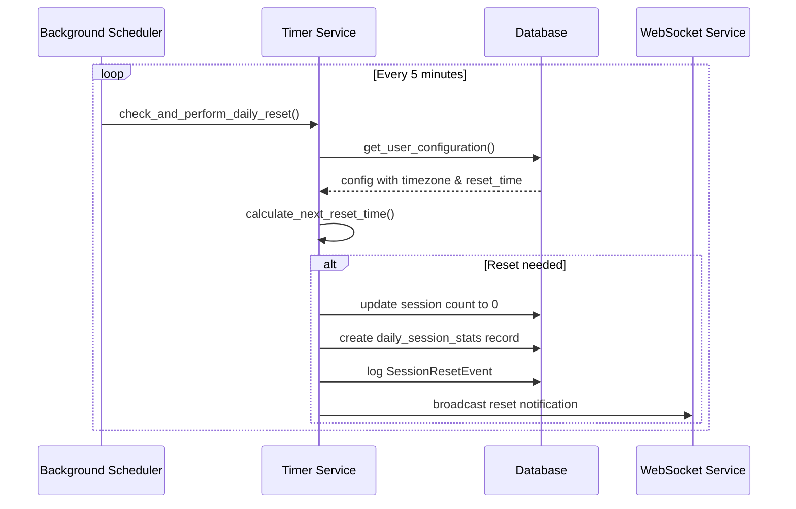
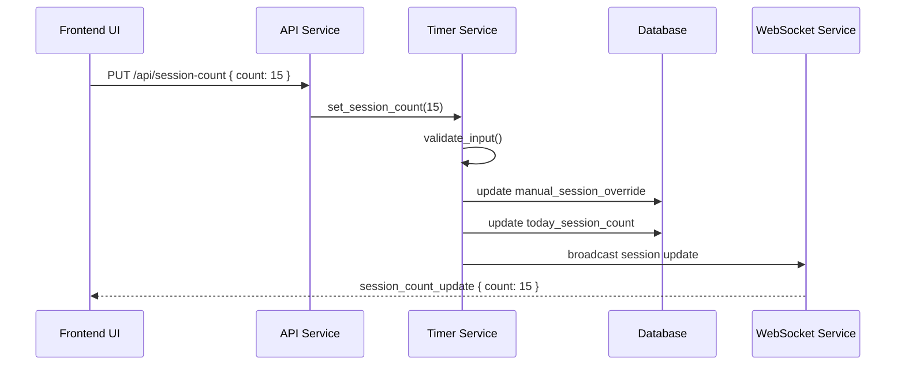
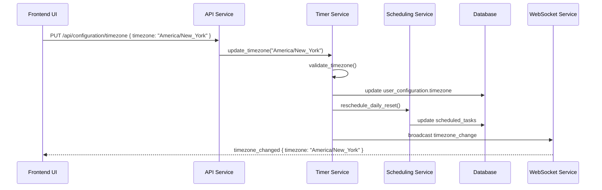

# Phase 1 Data Model: Daily Session Reset

**Purpose**: Data model design for the Daily Session Reset feature
**Date**: 2025-01-07
**Dependencies**: Research findings from Phase 0

## Entity Overview

This document defines the data entities and relationships required for implementing daily session reset functionality, building upon the existing Roma Timer data model.

## Core Entities

### 1. UserConfiguration (Extended)

Extends the existing `UserConfiguration` entity to support timezone-aware daily reset functionality.

```rust
use chrono::{DateTime, Utc};
use serde::{Deserialize, Serialize};
use chrono_tz::Tz;

#[derive(Debug, Clone, PartialEq, Eq, Serialize, Deserialize, sqlx::FromRow)]
pub struct UserConfiguration {
    pub id: String,

    // Existing fields...
    pub user_id: String,
    pub theme: String,
    pub work_duration: u32,
    pub short_break_duration: u32,
    pub long_break_duration: u32,
    pub long_break_interval: u32,
    pub auto_start_work: bool,
    pub auto_start_break: bool,
    pub sound_enabled: bool,
    pub notification_enabled: bool,
    pub created_at: u64,
    pub updated_at: u64,

    // New fields for daily session reset...
    /// User's timezone (IANA timezone identifier)
    pub timezone: String,

    /// Daily reset time configuration
    pub daily_reset_time: DailyResetTime,

    /// Timestamp of last daily reset (UTC Unix timestamp)
    pub last_daily_reset: Option<u64>,

    /// Current session count for today
    pub today_session_count: u32,

    /// Manual session override count (0 = no override)
    pub manual_session_override: Option<u32>,
}

#[derive(Debug, Clone, PartialEq, Eq, Serialize, Deserialize, sqlx::Type)]
#[sqlx(type_name = "text")]
pub enum DailyResetTime {
    /// Reset at midnight in user's timezone
    Midnight,
    /// Reset at specific hour (0-23) in user's timezone
    Hour(u8),
    /// Custom time in HH:MM format
    Custom(String),
}

impl Default for DailyResetTime {
    fn default() -> Self {
        DailyResetTime::Midnight
    }
}
```

**Validation Rules**:
- `timezone`: Must be valid IANA timezone identifier (e.g., "America/New_York", "UTC")
- `daily_reset_time.Hour`: Value must be 0-23
- `daily_reset_time.Custom`: Must match regex `^([01]?[0-9]|2[0-3]):[0-5][0-9]$`
- `today_session_count`: Non-negative integer, max 1000
- `manual_session_override`: Must be valid if set (0-1000)

**State Transitions**:
```
Initial State → Timezone Configured → Reset Time Configured → Active
     ↓                ↓                     ↓
  Default (UTC)    User-selected        Daily reset active
```

### 2. DailySessionStats

Tracks daily session statistics for analytics and reporting.

```rust
#[derive(Debug, Clone, PartialEq, Eq, Serialize, Deserialize, sqlx::FromRow)]
pub struct DailySessionStats {
    pub id: String,
    pub user_id: String,

    /// Date in UTC format (YYYY-MM-DD)
    pub date: String,

    /// User's timezone at time of sessions
    pub timezone: String,

    /// Total work sessions completed
    pub work_sessions_completed: u32,

    /// Total work time in seconds
    pub total_work_seconds: u32,

    /// Total break time in seconds
    pub total_break_seconds: u32,

    /// Manual session overrides applied
    pub manual_overrides: u32,

    pub created_at: u64,
    pub updated_at: u64,
}

impl DailySessionStats {
    pub fn new(user_id: String, date: String, timezone: String) -> Self {
        Self {
            id: uuid::Uuid::new_v4().to_string(),
            user_id,
            date,
            timezone,
            work_sessions_completed: 0,
            total_work_seconds: 0,
            total_break_seconds: 0,
            manual_overrides: 0,
            created_at: Utc::now().timestamp() as u64,
            updated_at: Utc::now().timestamp() as u64,
        }
    }
}
```

**Validation Rules**:
- `date`: Must match regex `^\d{4}-\d{2}-\d{2}$`
- `timezone`: Must be valid IANA timezone identifier
- All count fields: Non-negative integers

**Unique Constraints**:
- `(user_id, date)` combination must be unique

### 3. ScheduledTask (New)

Manages background scheduled tasks for daily resets.

```rust
#[derive(Debug, Clone, PartialEq, Eq, Serialize, Deserialize, sqlx::FromRow)]
pub struct ScheduledTask {
    pub id: String,
    pub user_id: String,

    /// Task type identifier
    pub task_type: ScheduledTaskType,

    /// Cron expression for scheduling
    pub cron_expression: String,

    /// Timezone for task execution
    pub timezone: String,

    /// Last execution timestamp (UTC)
    pub last_executed_at: Option<u64>,

    /// Next scheduled execution timestamp (UTC)
    pub next_execution_at: u64,

    /// Whether task is currently active
    pub is_active: bool,

    pub created_at: u64,
    pub updated_at: u64,
}

#[derive(Debug, Clone, PartialEq, Eq, Serialize, Deserialize, sqlx::Type)]
#[sqlx(type_name = "text")]
pub enum ScheduledTaskType {
    DailyReset,
    // Future task types can be added here
}
```

**Validation Rules**:
- `cron_expression`: Valid cron expression
- `timezone`: Must be valid IANA timezone identifier
- `next_execution_at`: Must be in future for active tasks

### 4. SessionResetEvent (New)

Audits session reset events for debugging and analytics.

```rust
#[derive(Debug, Clone, PartialEq, Eq, Serialize, Deserialize, sqlx::FromRow)]
pub struct SessionResetEvent {
    pub id: String,
    pub user_id: String,

    /// Type of reset event
    pub reset_type: SessionResetType,

    /// Session count before reset
    pub previous_count: u32,

    /// Session count after reset (should be 0 for most types)
    pub new_count: u32,

    /// Reset time in UTC
    pub reset_timestamp: u64,

    /// User's timezone at reset time
    pub user_timezone: String,

    /// Local time when reset occurred
    pub local_reset_time: String,

    /// Device that triggered the reset
    pub device_id: Option<String>,

    /// Additional context
    pub context: Option<String>,

    pub created_at: u64,
}

#[derive(Debug, Clone, PartialEq, Eq, Serialize, Deserialize, sqlx::Type)]
#[sqlx(type_name = "text")]
pub enum SessionResetType {
    /// Automatic daily reset at configured time
    ScheduledDaily,
    /// Manual reset by user
    ManualReset,
    /// Reset due to timezone change
    TimezoneChange,
    /// Reset due to configuration change
    ConfigurationChange,
}
```

## Entity Relationships

```mermaid
erDiagram
    UserConfiguration ||--o{ DailySessionStats : tracks
    UserConfiguration ||--o{ ScheduledTask : schedules
    UserConfiguration ||--o{ SessionResetEvent : generates
    UserConfiguration ||--|| TimerSession : contains

    UserConfiguration {
        string id PK
        string user_id
        string timezone
        DailyResetTime daily_reset_time
        u64 last_daily_reset
        u32 today_session_count
        u32 manual_session_override
        // ... existing fields
    }

    DailySessionStats {
        string id PK
        string user_id FK
        string date
        string timezone
        u32 work_sessions_completed
        u32 total_work_seconds
        u32 total_break_seconds
        u32 manual_overrides
        u64 created_at
        u64 updated_at
    }

    ScheduledTask {
        string id PK
        string user_id FK
        ScheduledTaskType task_type
        string cron_expression
        string timezone
        u64 last_executed_at
        u64 next_execution_at
        bool is_active
        u64 created_at
        u64 updated_at
    }

    SessionResetEvent {
        string id PK
        string user_id FK
        SessionResetType reset_type
        u32 previous_count
        u32 new_count
        u64 reset_timestamp
        string user_timezone
        string local_reset_time
        string device_id
        string context
        u64 created_at
    }

    TimerSession {
        string id PK
        string user_id FK
        // ... existing fields
    }
```

## Database Schema

### Updated Tables

```sql
-- Extended user_configurations table
CREATE TABLE user_configurations (
    id TEXT PRIMARY KEY,
    user_id TEXT NOT NULL,

    -- Existing fields...
    theme TEXT NOT NULL DEFAULT 'dark',
    work_duration INTEGER NOT NULL DEFAULT 1500,
    short_break_duration INTEGER NOT NULL DEFAULT 300,
    long_break_duration INTEGER NOT NULL DEFAULT 900,
    long_break_interval INTEGER NOT NULL DEFAULT 4,
    auto_start_work BOOLEAN NOT NULL DEFAULT true,
    auto_start_break BOOLEAN NOT NULL DEFAULT true,
    sound_enabled BOOLEAN NOT NULL DEFAULT true,
    notification_enabled BOOLEAN NOT NULL DEFAULT true,
    created_at INTEGER NOT NULL,
    updated_at INTEGER NOT NULL,

    -- New fields for daily session reset...
    timezone TEXT NOT NULL DEFAULT 'UTC',
    daily_reset_time TEXT NOT NULL DEFAULT 'Midnight',
    last_daily_reset INTEGER,
    today_session_count INTEGER NOT NULL DEFAULT 0,
    manual_session_override INTEGER
);

-- New table for daily session statistics
CREATE TABLE daily_session_stats (
    id TEXT PRIMARY KEY,
    user_id TEXT NOT NULL,
    date TEXT NOT NULL,
    timezone TEXT NOT NULL,
    work_sessions_completed INTEGER NOT NULL DEFAULT 0,
    total_work_seconds INTEGER NOT NULL DEFAULT 0,
    total_break_seconds INTEGER NOT NULL DEFAULT 0,
    manual_overrides INTEGER NOT NULL DEFAULT 0,
    created_at INTEGER NOT NULL,
    updated_at INTEGER NOT NULL,

    FOREIGN KEY (user_id) REFERENCES users(id),
    UNIQUE(user_id, date)
);

-- New table for scheduled tasks
CREATE TABLE scheduled_tasks (
    id TEXT PRIMARY KEY,
    user_id TEXT NOT NULL,
    task_type TEXT NOT NULL,
    cron_expression TEXT NOT NULL,
    timezone TEXT NOT NULL,
    last_executed_at INTEGER,
    next_execution_at INTEGER NOT NULL,
    is_active BOOLEAN NOT NULL DEFAULT true,
    created_at INTEGER NOT NULL,
    updated_at INTEGER NOT NULL,

    FOREIGN KEY (user_id) REFERENCES users(id)
);

-- New table for session reset events
CREATE TABLE session_reset_events (
    id TEXT PRIMARY KEY,
    user_id TEXT NOT NULL,
    reset_type TEXT NOT NULL,
    previous_count INTEGER NOT NULL,
    new_count INTEGER NOT NULL,
    reset_timestamp INTEGER NOT NULL,
    user_timezone TEXT NOT NULL,
    local_reset_time TEXT NOT NULL,
    device_id TEXT,
    context TEXT,
    created_at INTEGER NOT NULL,

    FOREIGN KEY (user_id) REFERENCES users(id)
);

-- Indexes for performance
CREATE INDEX idx_daily_session_stats_user_date ON daily_session_stats(user_id, date);
CREATE INDEX idx_scheduled_tasks_active ON scheduled_tasks(user_id, is_active);
CREATE INDEX idx_session_reset_events_user_timestamp ON session_reset_events(user_id, reset_timestamp);
CREATE INDEX idx_user_configurations_user_id ON user_configurations(user_id);
```

## Data Flow Patterns

### 1. Daily Reset Process



### 2. Manual Session Override



### 3. Timezone Configuration Change



## State Management

### Session Count State

```rust
#[derive(Debug, Clone)]
pub struct SessionCountState {
    pub current_count: u32,
    pub manual_override: Option<u32>,
    pub last_reset_time: Option<DateTime<Utc>>,
    pub next_reset_time: Option<DateTime<Utc>>,
    pub today_date: String, // YYYY-MM-DD in UTC
}

impl SessionCountState {
    pub fn should_reset(&self, now: DateTime<Utc>, reset_time_config: &DailyResetTime, timezone: &Tz) -> bool {
        // Implementation details...
        false
    }

    pub fn apply_manual_override(&mut self, count: u32) -> Result<(), SessionCountError> {
        if count > 1000 {
            return Err(SessionCountError::InvalidCount);
        }
        self.manual_override = Some(count);
        self.current_count = count;
        Ok(())
    }

    pub fn perform_daily_reset(&mut self, reset_time: DateTime<Utc>) {
        self.last_reset_time = Some(reset_time);
        self.current_count = 0;
        self.manual_override = None;
    }
}
```

### Timezone-Aware Scheduling State

```rust
#[derive(Debug, Clone)]
pub struct TimezoneAwareSchedule {
    pub timezone: Tz,
    pub reset_time: DailyResetTime,
    pub next_reset_utc: DateTime<Utc>,
    pub last_reset_utc: Option<DateTime<Utc>>,
}

impl TimezoneAwareSchedule {
    pub fn calculate_next_reset(&self, now: DateTime<Utc>) -> DateTime<Utc> {
        let now_local = now.with_timezone(&self.timezone);

        let today_reset_local = match self.reset_time {
            DailyResetTime::Midnight => {
                now_local.date_naive().and_hms_opt(0, 0, 0).unwrap()
                    .and_local_timezone(self.timezone).unwrap()
            }
            DailyResetTime::Hour(hour) => {
                now_local.date_naive().and_hms_opt(hour as u32, 0, 0).unwrap()
                    .and_local_timezone(self.timezone).unwrap()
            }
            DailyResetTime::Custom(time_str) => {
                let parts: Vec<&str> = time_str.split(':').collect();
                let hour: u32 = parts[0].parse().unwrap();
                let minute: u32 = parts[1].parse().unwrap();
                now_local.date_naive().and_hms_opt(hour, minute, 0).unwrap()
                    .and_local_timezone(self.timezone).unwrap()
            }
        };

        // If reset time has passed today, schedule for tomorrow
        if today_reset_local <= now_local {
            (today_reset_local.date_naive() + chrono::Duration::days(1))
                .and_hms_opt(today_reset_local.hour(), today_reset_local.minute(), 0).unwrap()
                .and_local_timezone(self.timezone).unwrap()
        } else {
            today_reset_local
        }.with_timezone(&Utc)
    }
}
```

## Data Integrity Constraints

### Business Rules

1. **Session Count Validity**: Session counts must be non-negative and ≤ 1000
2. **Timezone Validity**: Only valid IANA timezone identifiers accepted
3. **Reset Time Validity**: Reset times must be within valid 24-hour range
4. **Daily Stats Uniqueness**: Only one daily stats record per user per date
5. **Task Scheduling**: Only one daily reset task per user active at a time

### Database Constraints

```sql
-- Check constraints for data validation
ALTER TABLE user_configurations ADD CONSTRAINT chk_timezone_valid
    CHECK (timezone IN (SELECT name FROM pg_timezone_names)); -- PostgreSQL
    -- For SQLite: Application-level validation

ALTER TABLE user_configurations ADD CONSTRAINT chk_session_count_range
    CHECK (today_session_count >= 0 AND today_session_count <= 1000);

ALTER TABLE user_configurations ADD CONSTRAINT chk_manual_override_range
    CHECK (manual_session_override IS NULL OR (manual_session_override >= 0 AND manual_session_override <= 1000));

ALTER TABLE daily_session_stats ADD CONSTRAINT chk_work_sessions_non_negative
    CHECK (work_sessions_completed >= 0);

ALTER TABLE daily_session_stats ADD CONSTRAINT chk_time_seconds_non_negative
    CHECK (total_work_seconds >= 0 AND total_break_seconds >= 0);

ALTER TABLE scheduled_tasks ADD CONSTRAINT chk_next_execution_future
    CHECK (next_execution_at > created_at);
```

## Migration Strategy

### Phase 1: Schema Migration

```sql
-- Step 1: Add new columns to existing user_configurations
ALTER TABLE user_configurations ADD COLUMN timezone TEXT NOT NULL DEFAULT 'UTC';
ALTER TABLE user_configurations ADD COLUMN daily_reset_time TEXT NOT NULL DEFAULT 'Midnight';
ALTER TABLE user_configurations ADD COLUMN last_daily_reset INTEGER;
ALTER TABLE user_configurations ADD COLUMN today_session_count INTEGER NOT NULL DEFAULT 0;
ALTER TABLE user_configurations ADD COLUMN manual_session_override INTEGER;

-- Step 2: Create new tables
CREATE TABLE daily_session_stats (/* as defined above */);
CREATE TABLE scheduled_tasks (/* as defined above */);
CREATE TABLE session_reset_events (/* as defined above */);

-- Step 3: Create indexes
CREATE INDEX idx_daily_session_stats_user_date ON daily_session_stats(user_id, date);
CREATE INDEX idx_scheduled_tasks_active ON scheduled_tasks(user_id, is_active);
CREATE INDEX idx_session_reset_events_user_timestamp ON session_reset_events(user_id, reset_timestamp);
```

### Phase 2: Data Migration

```rust
impl DatabaseManager {
    pub async fn migrate_to_daily_reset_support(&self) -> Result<()> {
        // Migrate existing session counts to today_session_count
        let existing_sessions = self.get_all_current_sessions().await?;

        for session in existing_sessions {
            let mut config = self.get_user_configuration(&session.user_id).await?
                .ok_or_else(|| anyhow!("User config not found"))?;

            // Count today's work sessions
            let today_count = self.count_work_sessions_today(&session.user_id).await?;
            config.today_session_count = today_count as u32;

            // Update configuration
            self.save_user_configuration(&config).await?;
        }

        Ok(())
    }
}
```

## Performance Considerations

### Query Optimization

1. **Daily Reset Checks**: Use efficient date comparisons and indexes
2. **Session Count Queries**: Cache current session count in memory
3. **Timezone Conversions**: Perform conversions only when necessary
4. **Background Tasks**: Batch database operations for better performance

### Index Strategy

```sql
-- Primary indexes for lookups
CREATE UNIQUE INDEX idx_user_configs_user_id ON user_configurations(user_id);
CREATE INDEX idx_daily_stats_user_date ON daily_session_stats(user_id, date);

-- Performance indexes for common queries
CREATE INDEX idx_scheduled_tasks_next_exec ON scheduled_tasks(next_execution_at) WHERE is_active = true;
CREATE INDEX idx_reset_events_recent ON session_reset_events(user_id, created_at DESC);
```

## Security Considerations

### Input Validation

1. **Timezone Input**: Validate against IANA timezone database
2. **Session Count Input**: Range validation and type checking
3. **Time Format**: Validate HH:MM format and range
4. **Cron Expressions**: Validate syntax and prevent injection

### Data Privacy

1. **Timezone Data**: Consider timezone preferences as personal data
2. **Session Statistics**: Aggregate analytics should be anonymized
3. **Audit Events**: Consider retention policies for reset events

## Testing Data Scenarios

### Test Data Sets

1. **Standard User**: UTC timezone, midnight reset
2. **International User**: Non-UTC timezone, custom reset time
3. **Edge Case User**: timezone during DST transition
4. **Power User**: Frequent manual overrides, timezone changes

### Validation Tests

```rust
#[cfg(test)]
mod data_model_tests {
    use super::*;

    #[tokio::test]
    async fn test_user_configuration_validation() {
        // Test valid timezone
        let config = UserConfiguration {
            timezone: "America/New_York".to_string(),
            daily_reset_time: DailyResetTime::Hour(7),
            ..Default::default()
        };
        assert!(config.validate_timezone().is_ok());

        // Test invalid timezone
        let invalid_config = UserConfiguration {
            timezone: "Invalid/Timezone".to_string(),
            ..Default::default()
        };
        assert!(invalid_config.validate_timezone().is_err());
    }

    #[tokio::test]
    async fn test_daily_session_stats_uniqueness() {
        // Test that we can't create duplicate daily stats for same user/date
        let user_id = "test_user".to_string();
        let date = "2025-01-07".to_string();

        let stats1 = DailySessionStats::new(user_id.clone(), date.clone(), "UTC".to_string());
        let stats2 = DailySessionStats::new(user_id, date, "UTC".to_string());

        // Should fail unique constraint when saving both
        assert!(db_manager.save_daily_session_stats(&stats1).await.is_ok());
        assert!(db_manager.save_daily_session_stats(&stats2).await.is_err());
    }
}
```

This data model provides a robust foundation for implementing the Daily Session Reset feature while maintaining data integrity, performance, and extensibility for future enhancements.